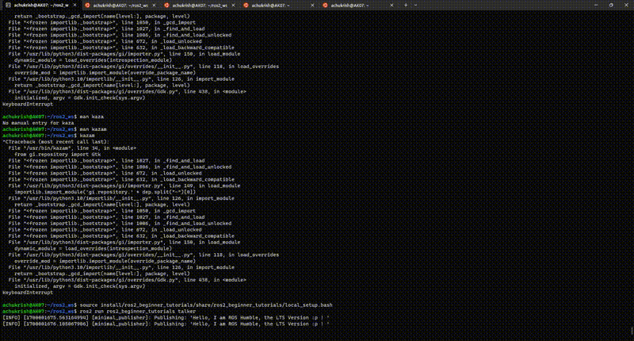

# ROS2_Beginner_Tutorials
## ENPM808X Assignment on ROS2 Basics

### Setup

In this chapter, we will create a ROS Workspace and learn how to run publisher and subscriber nodes.
First setup workspace using [ROS2_WS](https://docs.ros.org/en/humble/Tutorials/Beginner-Client-Libraries/Creating-A-Workspace/Creating-A-Workspace.html)

Once that is setup, clone our repo inside src folder.
```$ git clone  https://github.com/Achuthankrishna/ROS2_Beginner_Tutorials.git```

navigate out to workspace folder and type `colcon build` on your terminal to build the package.

Finally source your workspace using the command ```source install/setup.bash```

### Execution
 - To Run the publisher node,simply type :

    ```$ ros2 run ros2_beginner_tutorials talker```

 - To Run the Subscriber node, open a new terminal window parallely and simply type :

    ```$ ros2 run ros2_beginner_tutorials listener```
## Service Call
 - To Run the publisher node,simply type :

    ```$ ros2 run ros2_beginner_tutorials talker```

 - To Run the Subscriber node, open a new terminal window parallely and simply type :

    ```$ ros2 run ros2_beginner_tutorials listener```
- In a 3rd Terminal , source using 
   ``` $ source install/ros2_beginner_tutorials/share/ros2_beginner_tutorials/local_setup.bash```
   and then run,
   ```ros2 service call /change_string ros2_beginner_tutorials/srv/ChangeString "{update: 'LIBERTY TO ALL'}" ```
## Outputs
In case if there are dependency errors while building : Since this was done in WSl2 and there might be changes when it comes to linux, please look at the output given here :

