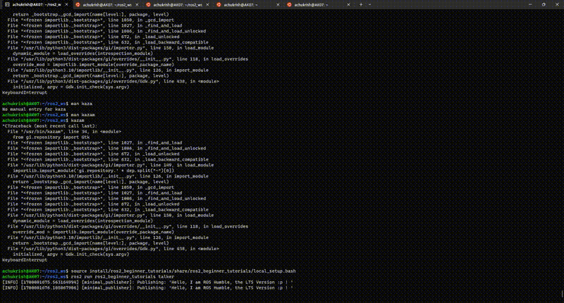
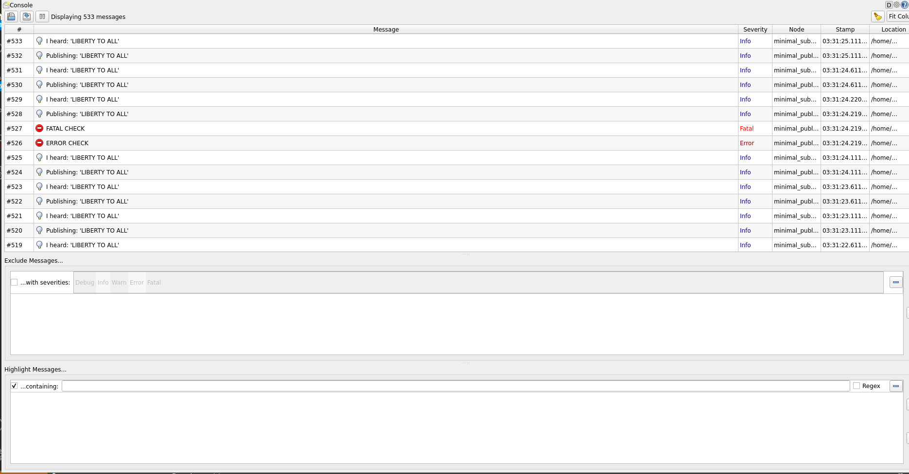
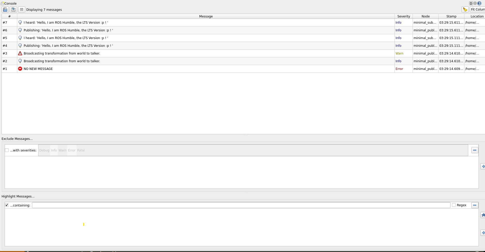

# ROS2_Beginner_Tutorials
## ENPM808X Assignment on ROS2 Basics

### Setup

In this chapter, we will create a ROS Workspace and learn how to run publisher and subscriber nodes.
First setup workspace using [ROS2_WS](https://docs.ros.org/en/humble/Tutorials/Beginner-Client-Libraries/Creating-A-Workspace/Creating-A-Workspace.html)

Once that is setup, clone our repo inside src folder.
```$ git clone  https://github.com/Achuthankrishna/ROS2_Beginner_Tutorials.git```

navigate out to workspace folder and type `colcon build` on your terminal to build the package.

Finally source your workspace using the command ```source install/setup.bash```

### Execution
 - To Run the publisher node,simply type :

    ```$ ros2 run ros2_beginner_tutorials talker```

 - To Run the Subscriber node, open a new terminal window parallely and simply type :

    ```$ ros2 run ros2_beginner_tutorials listener```
## Service Call
 - To Run the publisher node,simply type :

    ```$ ros2 run ros2_beginner_tutorials talker```
    
   To run debug log, run 
   ```ros2 run  cpp_pubsub talker --ros-args  --log-level DEBUG```

 - To Run the Subscriber node, open a new terminal window parallely and simply type :

    ```$ ros2 run ros2_beginner_tutorials listener```
- In a 3rd Terminal , source using 
  
   ``` $ source install/ros2_beginner_tutorials/share/ros2_beginner_tutorials/local_setup.bash```
   
   and then run,
   
   ```ros2 service call /change_string ros2_beginner_tutorials/srv/ChangeString "{update: 'LIBERTY TO ALL'}" ```


## Launch File
 - To Run the Launch file node,simply type :

    ```ros2 launch ros2_beginner_tutorials launch.py new_mesg:="I am Iron Ironwiyi"```

    where new_mesg is argument that modifies Talker node.

## Publish TF Frames

   # Using tf2 echo
   ```ros2 run tf2_ros tf2_echo world talker```   
   # tf2 View Frames
   ```ros2 run tf2_tools view_frames```
## Running Tests
```bash
   colcon build --packages-select ros2_beginner_tutorials
  colcon test --packages-select ros2_beginner_tutorials
# with verbose
  colcon test --event-handlers console_direct+ --packages-select ros2_beginner_tutorials
```

## Launch File For ROS Bag
 - To Run the Launch file node,simply type :

    ```ros2 launch ros2_beginner_tutorials launch_rosbag.py bag_record:="True" new_mesg:="testing ros bag files"```

    where new_mesg is argument that modifies Talker node and bag_record records the topics.
     ``` $ source install/ros2_beginner_tutorials/share/ros2_beginner_tutorials/local_setup.bash```
    To Run the Subscriber node, open a new terminal window parallely and simply type :

    ```$ ros2 run ros2_beginner_tutorials listener```
   
   Then play the rosbag file using the code 
   ```ros2 bag play /src/ROS2_Beginner_Tutorials/Results/Bags/Bags_0.db3```

 - To play the recorded files in a new terminal source the project:   
## Outputs
In case if there are dependency errors while building : Since this was done in WSl2 and there might be changes when it comes to linux, please look at the output given here :

## Rqt Console
The following is the rqt_console output when launch file launched

